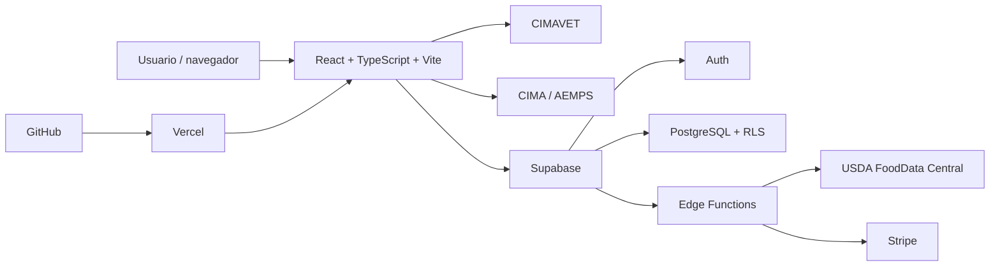

# WAIRUA VetAI

> Trabajo Fin de Máster - Máster de Desarrollo con IA<br>
> Autor: Germán Quintana<br>
> Entrega: 20 de julio de 2026

WAIRUA VetAI es una aplicación web clínica bilingüe para profesionales veterinarios. Reúne en un único espacio la consulta de medicamentos oficiales, una base terapéutica estructurada, herramientas de cálculo y flujos de revisión editorial con trazabilidad científica.

La plataforma está diseñada como apoyo a la toma de decisiones durante la consulta. No sustituye la ficha técnica oficial, la normativa aplicable ni el criterio del veterinario responsable.


## Enlaces de la entrega

| Recurso | Enlace |
| --- | --- |
| Aplicación desplegada | [https://guia-terapeutica.vercel.app](https://guia-terapeutica.vercel.app) |
| Repositorio público | [https://github.com/GermanQuintana/WAIRUA-VETAI-FORMULARIO](https://github.com/GermanQuintana/WAIRUA-VETAI-FORMULARIO) |
| Vídeo de presentación y demostración | [https://youtu.be/CShrRAhvURU](https://youtu.be/CShrRAhvURU) |
| Slides | [TFM Máster en desarrollo con IA - Google Slides](https://docs.google.com/presentation/d/1naPozS4nSkFAKNAMVbij7ki1x4udiswnNBdXmcN9S_g/edit?usp=sharing) |

## Credenciales de prueba

La siguiente cuenta se ha creado exclusivamente para la evaluación académica y dispone de acceso completo a la aplicación:

```text
Usuario:    mouredev@gmail.com
Contraseña: osOi_bC5KPrkd6k56KcW5QQc!A7
```

Acceso concedido:

- Plan `premium`.
- Roles `admin`, `reviewer`, `editor`, `contributor` y `viewer`.
- Acceso a las herramientas clínicas, el flujo editorial y el panel de administración.

Al finalizar la evaluación se debe rotar la contraseña o desactivar esta cuenta, ya que estas credenciales forman parte de un repositorio público.

## Descripción general

En la práctica clínica, la información necesaria suele estar repartida entre buscadores regulatorios, fichas técnicas, tablas de dosificación y calculadoras independientes. WAIRUA VetAI reduce esa fragmentación mediante una interfaz responsive, disponible en español e inglés y preparada para uso en escritorio o móvil.

El producto combina tres capas:

1. **Fuentes oficiales en vivo:** consulta de medicamentos veterinarios en CIMAVET, cruce con medicamentos de uso humano en CIMA y búsqueda nutricional mediante USDA FoodData Central.
2. **Conocimiento clínico estructurado:** principios activos, dosis por especie e indicación, contraindicaciones, interacciones, referencias y contenido editorial con procedencia identificable.
3. **Herramientas de trabajo:** calculadoras, rangos, protocolos y utilidades que reducen tareas manuales repetitivas.

La página pública permite comprender el producto y sus planes antes de registrarse. Tras iniciar sesión, el usuario accede a un espacio clínico compacto adaptado a su plan y a sus roles.

## Funcionalidades principales

### Consulta de medicamentos y conocimiento

- Búsqueda oficial de medicamentos veterinarios por nombre, principio activo y especie mediante CIMAVET.
- Consulta cruzada de medicamentos humanos en CIMA, con acceso a ficha técnica y prospecto cuando la fuente los ofrece.
- Índice terapéutico por principio activo, sistema, patología, especie y nombre comercial.
- Catálogo de productos OTC y dietas clínicas con enlace a su fuente.
- Fichas estructuradas con indicaciones, dosis, vía, presentación, contraindicaciones, efectos adversos, interacciones y referencias.
- Comprobador de interacciones farmacológicas.

### Toolkit clínico

- Calculadora de dosis.
- Infusiones y ritmos de administración.
- Constantes fisiológicas, perfusión, presión arterial y alertas de triage.
- Rangos de hematología, bioquímica, electrolitos, gasometría y equilibrio ácido-base.
- Fluidoterapia, mantenimiento, déficit, pérdidas continuas y suplementación.
- Superficie corporal y conversión de unidades.
- Hemoterapia.
- Nutrición clínica y construcción de dietas.
- Endocrinología y monitorización terapéutica.
- Genética clínica.
- Protocolos anestésicos.
- Urgencias, reanimación cardiopulmonar y referencias RECOVER.
- Formulario clínico rápido y utilidades de gestión.

### Cuentas, permisos y publicación

- Registro e inicio de sesión con email/contraseña o Google OAuth mediante Supabase Auth.
- Prueba completa de 10 días y planes `free`, `premium`, `company` y `partner`.
- Suscripciones y portal de facturación preparados con Stripe y Supabase Edge Functions.
- Cuentas de clínica con plazas, emails autorizados y código de invitación.
- Roles acumulables: `viewer`, `contributor`, `editor`, `reviewer` y `admin`.
- Flujo editorial con borrador, revisión, aprobación y publicación.
- Panel administrativo para usuarios, permisos, incidencias y vista previa por perfil.

### Experiencia y accesibilidad

- Interfaz completa en español e inglés.
- Temas claro y oscuro.
- Diseño responsive para móvil, tableta y escritorio.
- Navegación por teclado, nombres accesibles, foco visible y controles con etiquetas.
- Avisos legales, privacidad, condiciones y almacenamiento técnico sin analítica publicitaria.

## Recorrido recomendado para la evaluación

1. Abrir la [aplicación desplegada](https://guia-terapeutica.vercel.app).
2. Pulsar **Acceder** e iniciar sesión con las credenciales de prueba.
3. Comprobar en la barra superior el acceso Premium.
4. Explorar las áreas **Medicamentos**, **CIMA humana**, **Principios activos**, **OTC** y **Toolkit**.
5. Abrir **Cuenta** para revisar el perfil y los datos de acceso.
6. Entrar en **Administración** para comprobar el directorio de usuarios, los roles múltiples y la vista previa de permisos.
7. Cambiar idioma y tema, y repetir una búsqueda desde una anchura móvil.

## Stack tecnológico

| Área | Tecnología | Uso |
| --- | --- | --- |
| Frontend | React 18 + TypeScript 5 | Componentes, estado, tipado y lógica de interfaz |
| Build | Vite 5 | Desarrollo local y generación del paquete de producción |
| Estilos | CSS nativo | Sistema visual, temas y diseño responsive |
| Animación | GSAP | Transiciones de la presentación pública |
| Backend | Supabase | Auth, PostgreSQL, RLS y Edge Functions |
| Pagos | Stripe | Checkout, suscripciones, webhook y portal de cliente |
| Despliegue | Vercel | Hosting del frontend y despliegue desde GitHub |
| Fuentes externas | CIMAVET, CIMA/AEMPS y USDA FoodData Central | Medicamentos oficiales y datos nutricionales |
| Control de versiones | Git + GitHub | Historial, repositorio público y entrega del código |

## Arquitectura



El frontend nunca recibe claves de servicio. Las credenciales sensibles de Stripe y USDA se guardan como secretos de Supabase y sólo son utilizadas por Edge Functions. Las variables `VITE_` contienen exclusivamente configuración pública del cliente.

## Desarrollo asistido por IA

El proyecto se ha construido con un flujo de ingeniería asistido por agentes de IA. La IA se ha utilizado como copiloto para:

- descomponer requisitos y proponer iteraciones de arquitectura;
- generar y refactorizar componentes React y tipos TypeScript;
- estructurar datasets y contenido bilingüe;
- localizar errores de compilación, integración y responsive design;
- revisar seguridad, accesibilidad, consistencia visual y documentación;
- automatizar comprobaciones repetitivas y preparar despliegues.

Las decisiones de producto, la selección de fuentes, la revisión clínica y la aceptación final permanecen bajo responsabilidad humana. Cada cambio de código se valida mediante compilación TypeScript, build de Vite y comprobación en navegador. El MVP no envía consultas clínicas a un LLM ni presenta sus respuestas como evidencia terapéutica; las recomendaciones clínicas deben conservar una fuente científica u oficial verificable.

## Instalación y ejecución local

### Requisitos previos

- Node.js 18 o superior.
- npm 9 o superior.
- Una cuenta de Supabase para disponer de autenticación y persistencia reales. Sin Supabase, la interfaz utiliza su modo demo.

### 1. Clonar el repositorio

```bash
git clone https://github.com/GermanQuintana/WAIRUA-VETAI-FORMULARIO.git
cd WAIRUA-VETAI-FORMULARIO
```

### 2. Instalar dependencias

```bash
npm ci
```

### 3. Configurar el entorno

Copiar `.env.example` como `.env` y completar únicamente los valores públicos necesarios:

```env
VITE_APP_BASE_PATH=/
VITE_CIMA_BASE_URL=https://cima.aemps.es/cima/rest
VITE_CIMAVET_BASE_URL=https://cimavet.aemps.es/cimavet/rest
VITE_CIMAVET_API_KEY=
VITE_SUPABASE_URL=https://your-project.supabase.co
VITE_SUPABASE_ANON_KEY=your-supabase-anon-key
```

No se deben guardar en variables `VITE_` la clave `service_role`, secretos de Stripe, webhooks ni la clave de USDA.

### 4. Iniciar el servidor de desarrollo

```bash
npm run dev
```

Vite mostrará la URL local, normalmente `http://localhost:5173`.

### 5. Compilar y previsualizar producción

```bash
npm run build
npm run preview
```

El build ejecuta primero el compilador de TypeScript y genera el resultado final en `dist/`.

## Configuración de Supabase

Para reproducir el backend completo:

1. Crear un proyecto en Supabase.
2. Aplicar `supabase/schema.sql` y las migraciones de `supabase/migrations/`.
3. Configurar en Supabase Auth la URL del sitio y las URLs de redirección locales y desplegadas.
4. Desplegar las funciones de `supabase/functions/`.
5. Definir `USDA_FDC_API_KEY` como secreto de Supabase si se utilizará la búsqueda nutricional.
6. Seguir `supabase/stripe-setup.md` para activar la facturación y sus secretos.

Las tablas expuestas utilizan Row Level Security. Los permisos editoriales se guardan en `public.profiles` y no se derivan de metadatos editables por el usuario.

## Estructura del proyecto

```text
.
├── public/                         # Recursos públicos y favicon
├── scripts/                        # Generadores y utilidades de datos
├── src/
│   ├── assets/                     # Imágenes de marca y presentación
│   ├── components/                 # Auth, fichas y toolkits clínicos
│   ├── data/                       # Datos terapéuticos y clínicos estructurados
│   ├── lib/                        # Normalización, índices y términos
│   ├── services/                   # Supabase, CIMAVET, CIMA y nutrición
│   ├── App.tsx                     # Orquestación, navegación y workspace
│   ├── i18n.ts                     # Textos localizados
│   ├── styles.css                  # Sistema de estilos compartido
│   └── design.css                  # Rediseño y overrides actuales
├── supabase/
│   ├── functions/                  # USDA, Stripe y administración
│   ├── migrations/                 # Evolución versionada de PostgreSQL
│   ├── schema.sql                  # Esquema relacional y políticas RLS
│   └── stripe-setup.md             # Guía de facturación
├── .env.example                    # Plantilla de variables públicas
├── package.json                    # Dependencias y scripts
├── vercel.json                     # Configuración de despliegue
└── README.md                       # Documentación y entrega del TFM
```

## Scripts disponibles

| Comando | Descripción |
| --- | --- |
| `npm run dev` | Inicia Vite en modo desarrollo |
| `npm run build` | Ejecuta TypeScript y genera el build de producción |
| `npm run preview` | Sirve localmente el contenido de `dist/` |

## Despliegue

La versión de evaluación está publicada en Vercel:

**[https://guia-terapeutica.vercel.app](https://guia-terapeutica.vercel.app)**

El proyecto utiliza `dist` como directorio de salida. Los pushes a la rama principal del repositorio pueden generar un nuevo despliegue desde la integración GitHub-Vercel. En producción deben configurarse las variables públicas de Supabase y las URLs autorizadas de redirección OAuth.

## Seguridad, privacidad y límites

- Las claves privadas no se incluyen en el repositorio.
- PostgreSQL aplica RLS y separa las capacidades por roles editoriales.
- La cuenta de evaluación posee permisos administrativos y debe revocarse o rotarse tras la revisión.
- La aplicación no incorpora analítica, publicidad ni seguimiento no esencial en su estado actual.
- Los textos legales del repositorio son un borrador de implementación y requieren revisión profesional antes de un lanzamiento comercial.
- La disponibilidad de CIMAVET, CIMA, USDA y Stripe depende de servicios externos.
- No existe todavía una suite automatizada de tests; la verificación actual se apoya en `npm run build` y pruebas manuales de navegador.
- El contenido terapéutico debe confirmarse siempre con la fuente oficial y el contexto clínico del paciente.

## Fuentes e integraciones principales

- [CIMAVET - AEMPS](https://cimavet.aemps.es/cimavet/publico/home.html)
- [CIMA - AEMPS](https://cima.aemps.es/cima/publico/home.html)
- [Agencia Española de Medicamentos y Productos Sanitarios](https://www.aemps.gob.es/)
- [USDA FoodData Central](https://fdc.nal.usda.gov/)
- [Supabase](https://supabase.com/)
- [Stripe](https://stripe.com/)
- [Vercel](https://vercel.com/)

## Licencia y contribuciones

El código se distribuye bajo licencia [MIT](LICENSE). Las contribuciones deben seguir [CONTRIBUTING.md](CONTRIBUTING.md) y, cuando modifiquen contenido clínico, aportar fuente, especie, indicación y nivel de evidencia.

---

Desarrollado por Germán Quintana para WAIRUA VetAI - Wairua Veterinary Precision Medicine, S.L.U.
